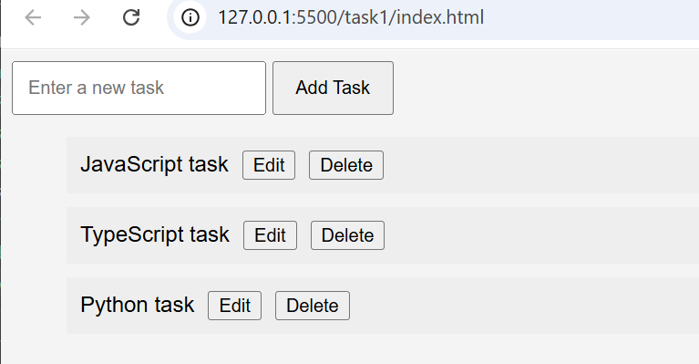

# Todo List App

## Description

This is a simple Todo List application made using HTML, CSS, and JavaScript.

The app allows users to:

- Add a task
- Edit a task
- Delete a task

## Technologies Used

- HTML
- CSS
- JavaScript

## How to Run

1. Download or clone this repository.
2. Open the project folder.
3. Open the `index.html` file in a web browser.

## How to Use

### Add a Task

Type a task in the input field and click the **Add Task** button.

### Edit a Task

Click the **Edit** button next to a task and enter the new task.

### Delete a Task

Click the **Delete** button next to a task to remove it.

## Screenshot

### Todo List App

This screenshot shows the Todo List application with the options to add, edit, and delete tasks.
